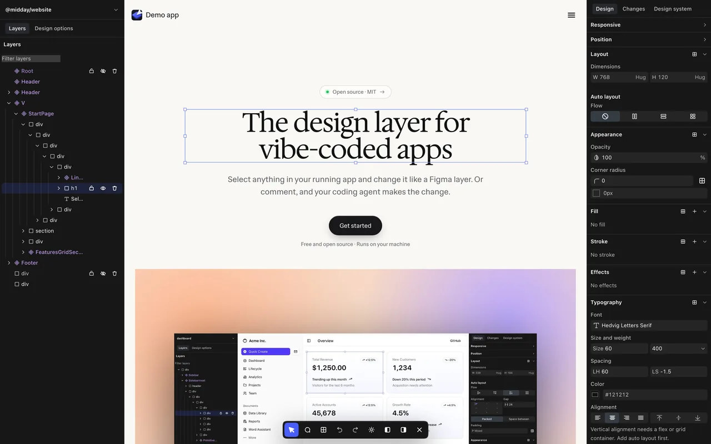
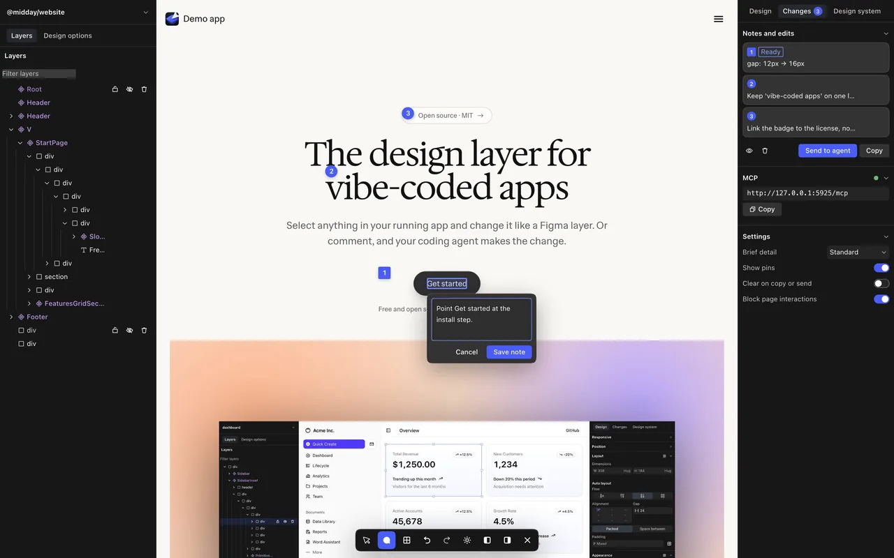
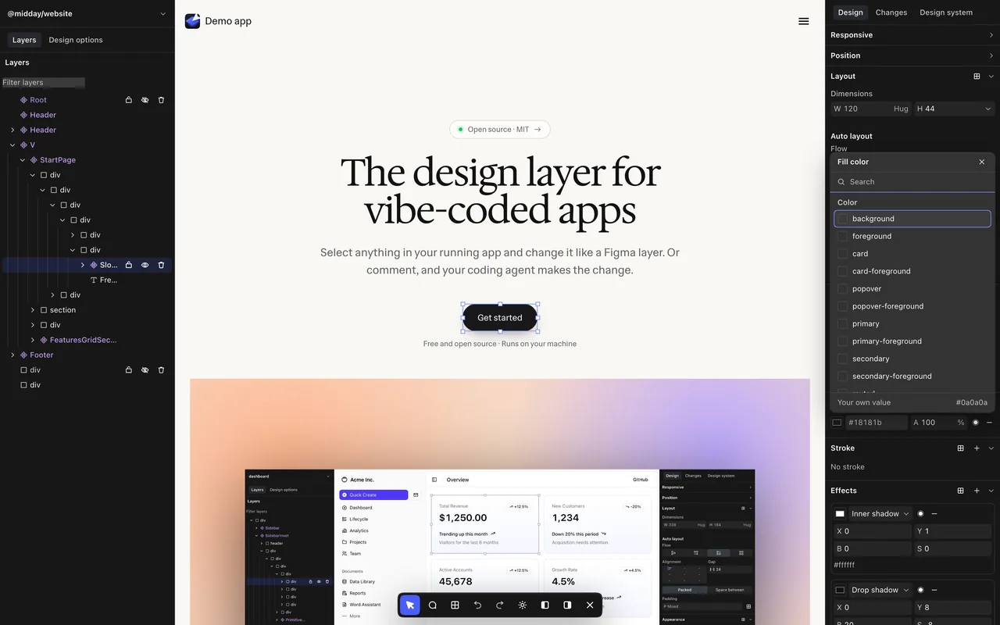
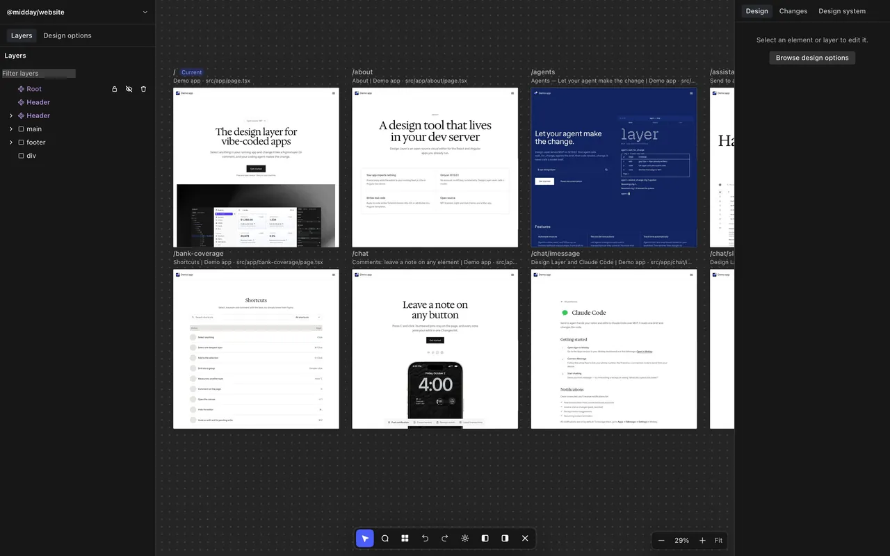
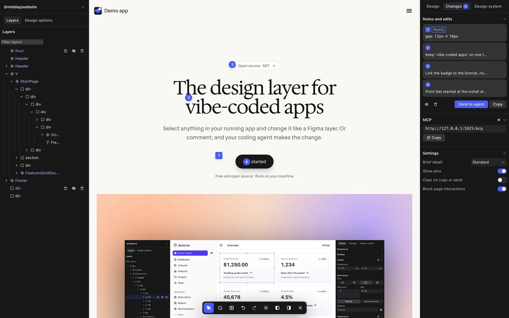
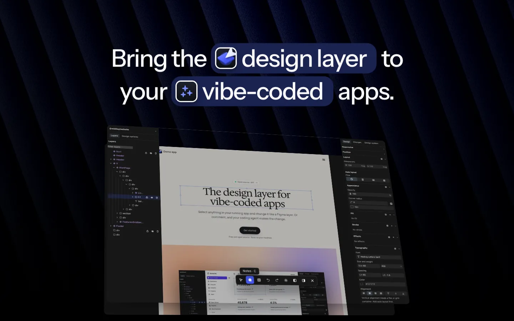
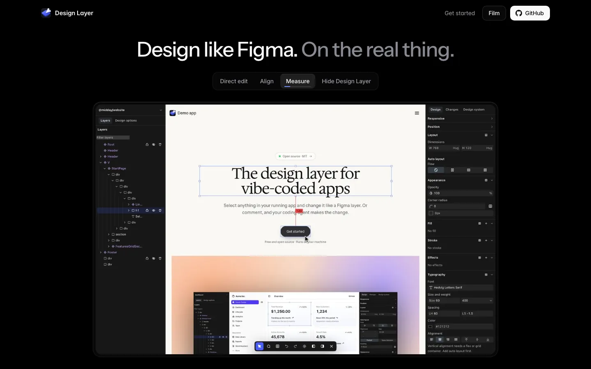
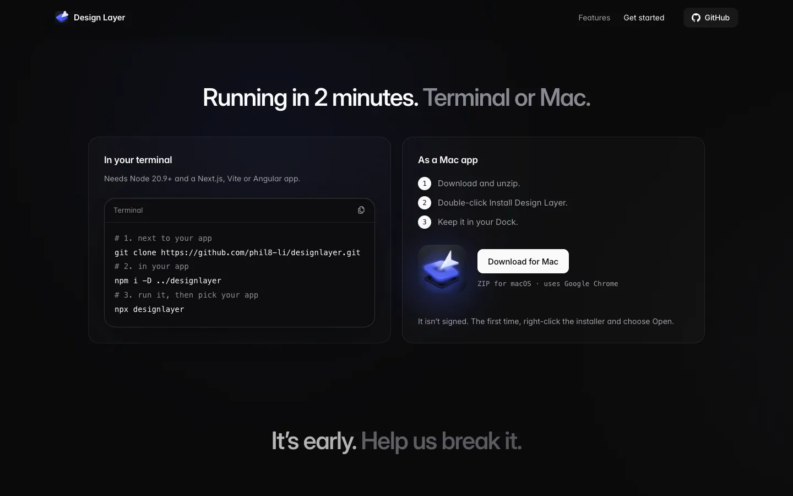

# DesignLayer

**Edit your running React or Angular app like a Figma file. Every change lands in your source code.**

DesignLayer sits in front of your dev server as a proxy. Select anything on the
page, change its layout, spacing, type, or design tokens, and it writes the edit
back into the component that renders it. Or leave a note, and your coding agent
makes the change over MCP.



- **Edit, and keep it.** Layout, spacing, typography, fill, effects, insert and delete — written to real source (Tailwind classes on React, templates on Angular).
- **Your design system, not ours.** Token pickers, components, and icons come from whatever your app already loads.
- **Comment instead of coding.** Pin notes on elements and send them, with the source they point at, to Claude Code, Cursor, VS Code, or any MCP client.
- **Nothing to install in your app.** Your app never imports DesignLayer. Stop the proxy and it leaves no trace.

## Quick start

Requires Node 20.9+ and a React (Next.js or Vite) or Angular app with a dev script.

```sh
git clone https://github.com/phil8-li/design-layer.git
cd your-app
npm i -D ../design-layer
npx designlayer
```

A start screen opens in your browser. Pick your app (running or not), point it at
the project folder, and press **Start editing**. DesignLayer starts the dev server if
needed and puts the editor around your app.

Already know the port? `npx designlayer --dev --open 3000`.

On a Mac you can install it as a Dock app instead, with Node 20.9+ and Chrome and no clone:

```sh
curl -fsSL https://phil8-li.github.io/design-layer/downloads/install.sh | bash
```

## See it

| Leave notes for your agent | Use your own tokens |
| --- | --- |
|  |  |
| **Every page at once** | **One list of edits and notes** |
|  |  |

## Connect your coding agent

The editor serves MCP at `http://127.0.0.1:5747/mcp`. Add it as a **remote** server:

```sh
claude mcp add --transport http designlayer http://127.0.0.1:5747/mcp
```

Then tell your agent: *"Work the DesignLayer loop: `wait_for_change`, apply it,
`resolve_change`, repeat."* Pressing **Send to agent** in the editor hands it the
next batch. Details: [docs/agent-handoff.md](docs/agent-handoff.md).

Working on this repo with an agent? Point it at [AGENTS.md](AGENTS.md).

## Documentation

| Read | For |
| --- | --- |
| [Using DesignLayer](docs/using.md) | Start screen, shortcuts, panels, canvas view, CLI flags, Mac app |
| [Configuration](docs/configuration.md) | Tailwind, design-system manifests and adapters, icons, companions |
| [Angular hosts](docs/angular.md) | How Angular apps are detected and edited |
| [Agent handoff (MCP)](docs/agent-handoff.md) | The four MCP tools and the wait/apply/resolve loop |
| [Architecture](docs/architecture.md) | What it writes, security model, performance, file layout |
| [Testing](docs/testing.md) | Running the suites, host-pinned tests |
| [Mac app](desktop/mac/README.md) | Install DesignLayer as a Dock app |

## Landing page

The marketing site is hosted on GitHub Pages at
**[phil8-li.github.io/design-layer](https://phil8-li.github.io/design-layer/)**. Its
source and launch films live in [`landing/`](landing/), a standalone module with
its own README and deploy workflow.



| Design like Figma, on the real thing | Running in 2 minutes |
| --- | --- |
|  |  |

## Contributing

A fresh clone is green: `npm install && npm test`. Start with
[CONTRIBUTING.md](CONTRIBUTING.md), and look for issues labeled
[`good first issue`](https://github.com/phil8-li/design-layer/labels/good%20first%20issue).
Security reports go through [SECURITY.md](SECURITY.md), not public issues.

## License

[MIT](LICENSE) © Phil Li. Third-party code is listed in
[THIRD_PARTY_NOTICES.md](THIRD_PARTY_NOTICES.md).
